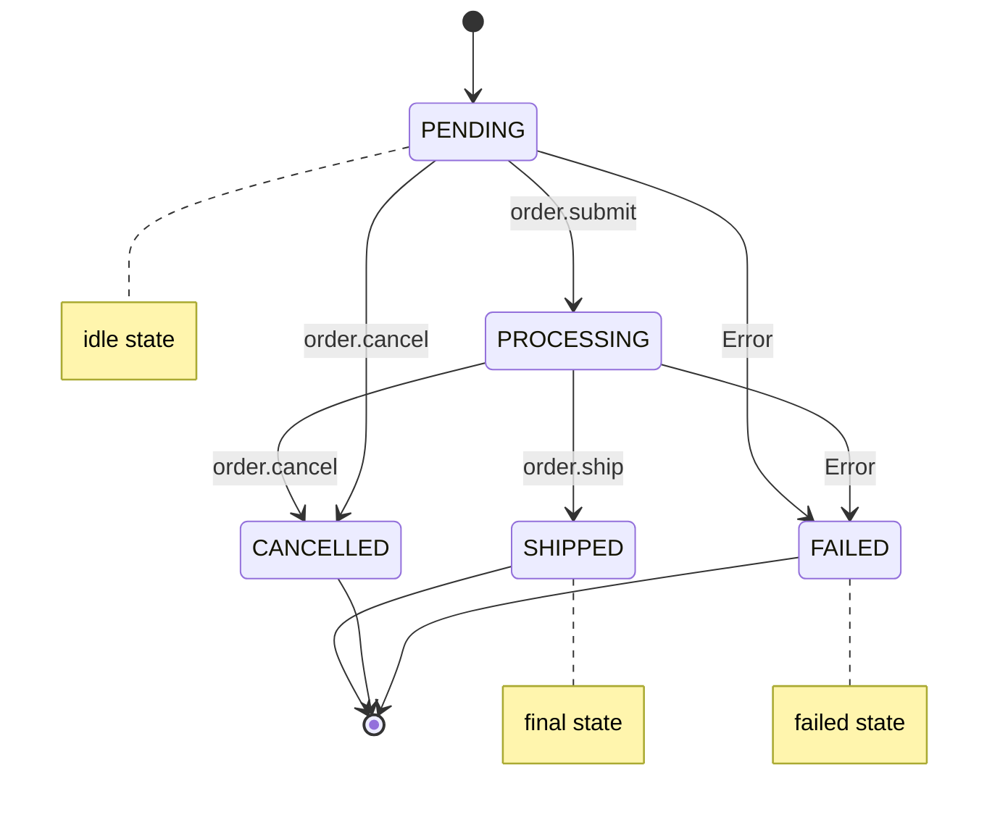

## State Categories

Every workflow defines three kinds of states:

```typescript
states: {
  finals: [OrderStatus.Completed, OrderStatus.Cancelled],
  idles: [OrderStatus.Pending],
  failed: OrderStatus.Failed,
}
```

| Category | Meaning | What happens |
|----------|---------|-------------|
| **finals** | Terminal states — workflow is done | Orchestrator returns `{ status: 'final' }` |
| **idles** | Pause states — waiting for external input | Orchestrator returns `{ status: 'idle' }`, adapter waits for callback |
| **failed** | Error fallback — entity moves here on unhandled errors | Handler threw, entity auto-transitions to this state |



## Defining Transitions

Transitions declare how entities move between states in response to events:

```typescript
{
  event: 'order.submit',
  from: [OrderStatus.Pending],
  to: OrderStatus.Processing,
}
```

- `event` — the trigger event name
- `from` — array of valid source states (supports multiple origins)
- `to` — the target state
- `conditions` — optional guard functions (see below)

## How Transitions Are Resolved

When `orchestrator.transit()` is called:

1. Match the event name against registered transitions
2. Check the entity's current state is in the transition's `from` array
3. Evaluate all condition functions (if any)
4. Execute the `@OnEvent` handler
5. Update the entity to the `to` state
6. Determine the [TransitResult](/docs/api-reference/adapters#transitresult)

If multiple transitions match the same event and state but have different `to` states, the router throws `BadRequestException` — ambiguous state machines are not allowed.

## Conditional Transitions

Add condition functions to gate when a transition fires. All conditions must return `true`:

```typescript
{
  event: 'order.approve',
  from: [OrderStatus.PendingApproval],
  to: OrderStatus.Approved,
  conditions: [
    (entity: Order, payload?: { approved: boolean }) => payload?.approved === true,
  ],
}
```

### Branching with Conditions

Use the same event with different conditions to create branching logic:

```typescript
// Approve path
{
  event: 'order.review',
  from: [OrderStatus.PendingApproval],
  to: OrderStatus.Approved,
  conditions: [(_, payload?: { approved: boolean }) => payload?.approved === true],
},
// Reject path
{
  event: 'order.review',
  from: [OrderStatus.PendingApproval],
  to: OrderStatus.Rejected,
  conditions: [(_, payload?: { approved: boolean }) => payload?.approved === false],
},
```

### Global Conditions

Workflow-level conditions apply to every transition in the workflow:

```typescript
@Workflow({
  // ...
  conditions: [
    (entity: Order) => entity.isActive,  // must be active for any transition
  ],
})
```

## Auto-Continuation

When a transition lands in a state that is **neither idle nor final**, the orchestrator automatically looks for the next valid transition and returns `{ status: 'continued', nextEvent }`. The adapter feeds this back into `transit()` without external intervention.

This enables multi-step workflows to chain automatically:

```
PENDING (idle) → transit → PROCESSING → auto-continue → SHIPPED (final)
```

Only idle states act as "breakpoints" where the workflow pauses.

## Related

- [Workflow Definition](/docs/concepts/workflow-definition) — the `@Workflow` decorator and full definition shape
- [Events and Handlers](/docs/concepts/events-and-handlers) — `@OnEvent`, `@OnDefault`, parameter injection
- [TransitResult](/docs/api-reference/adapters#transitresult) — what `transit()` returns
