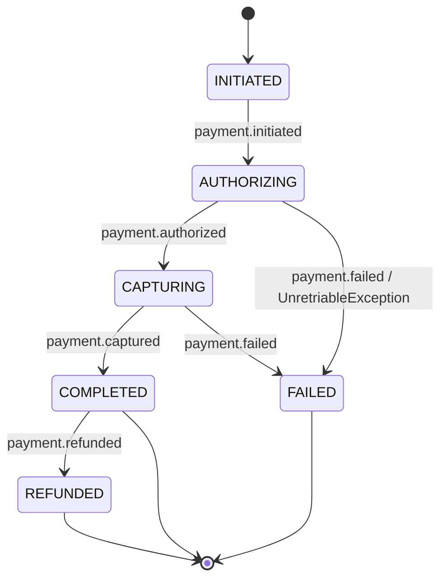

# Payment Processing with Retry

A multi-step payment workflow demonstrating `@WithRetry`, `UnretriableException`, and retry strategies in action.

## Workflow States



### State Transitions

1. **INITIATED** — payment created, waiting for processing (idle state)
2. **AUTHORIZING** — contacting payment gateway for authorization (idle, retries on transient failure)
3. **CAPTURING** — capturing authorized funds (idle, retries on transient failure)
4. **COMPLETED** — payment successfully processed (final)
5. **FAILED** — payment failed permanently (final)
6. **REFUNDED** — payment refunded after completion (final)

## Entity

```typescript
import { Injectable } from '@nestjs/common';
import type { IWorkflowEntity } from 'nestflow-js/core';

export enum PaymentState {
  INITIATED = 'initiated',
  AUTHORIZING = 'authorizing',
  CAPTURING = 'capturing',
  COMPLETED = 'completed',
  FAILED = 'failed',
  REFUNDED = 'refunded',
}

export interface Payment {
  id: string;
  status: PaymentState;
  amount: number;
  currency: string;
  cardNumber?: string;
  authorizationCode?: string;
  captureId?: string;
  errorMessage?: string;
  retryCount: number;
}

@Injectable()
export class PaymentEntityService implements IWorkflowEntity<Payment, PaymentState> {
  constructor(private readonly repository: PaymentRepository) {}

  async create(): Promise<Payment> {
    return this.repository.create({
      status: PaymentState.INITIATED,
      amount: 0,
      currency: 'USD',
      retryCount: 0,
    });
  }

  async load(urn: string | number): Promise<Payment | null> {
    return this.repository.findById(String(urn));
  }

  async update(payment: Payment, status: PaymentState): Promise<Payment> {
    return this.repository.update(payment.id, { ...payment, status });
  }

  status(payment: Payment): PaymentState {
    return payment.status;
  }

  urn(payment: Payment): string | number {
    return payment.id;
  }
}
```

## Workflow Definition

The key pattern here: `@WithRetry` on the authorization and capture steps, plus `UnretriableException` for permanent failures like invalid cards.

```typescript
import { Logger } from '@nestjs/common';
import { Entity, OnEvent, Payload, Workflow, WithRetry } from 'nestflow-js/core';
import { RetryStrategy } from 'nestflow-js/core';
import { UnretriableException } from 'nestflow-js/exception';
import type { Payment } from './payment.entity';
import { PaymentState } from './payment.entity';

export enum PaymentEvent {
  INITIATED = 'payment.initiated',
  AUTHORIZED = 'payment.authorized',
  CAPTURED = 'payment.captured',
  FAILED = 'payment.failed',
  REFUNDED = 'payment.refunded',
}

@Workflow<Payment, PaymentEvent, PaymentState>({
  name: 'PaymentWorkflow',
  states: {
    finals: [PaymentState.COMPLETED, PaymentState.FAILED, PaymentState.REFUNDED],
    idles: [PaymentState.INITIATED, PaymentState.AUTHORIZING, PaymentState.CAPTURING],
    failed: PaymentState.FAILED,
  },
  transitions: [
    {
      event: PaymentEvent.INITIATED,
      from: [PaymentState.INITIATED],
      to: PaymentState.AUTHORIZING,
    },
    {
      event: PaymentEvent.AUTHORIZED,
      from: [PaymentState.AUTHORIZING],
      to: PaymentState.CAPTURING,
    },
    {
      event: PaymentEvent.CAPTURED,
      from: [PaymentState.CAPTURING],
      to: PaymentState.COMPLETED,
    },
    {
      event: PaymentEvent.FAILED,
      from: [PaymentState.AUTHORIZING, PaymentState.CAPTURING],
      to: PaymentState.FAILED,
    },
    {
      event: PaymentEvent.REFUNDED,
      from: [PaymentState.COMPLETED],
      to: PaymentState.REFUNDED,
    },
  ],
  entityService: 'entity.payment',
})
export class PaymentWorkflow {
  private readonly logger = new Logger(PaymentWorkflow.name);

  @OnEvent(PaymentEvent.INITIATED)
  async handleInitiated(@Entity() payment: Payment, @Payload() payload: any) {
    this.logger.log(`Payment ${payment.id} initiated for ${payload?.amount} ${payload?.currency}`);
    return { amount: payload?.amount, cardNumber: payload?.cardNumber };
  }

  /**
   * Authorization step with retry.
   * - Transient errors (network timeout) → retried with exponential jitter
   * - Invalid card → UnretriableException, moves to FAILED immediately
   */
  @OnEvent(PaymentEvent.AUTHORIZED)
  @WithRetry({
    handler: 'handleAuthorized',
    maxAttempts: 3,
    strategy: RetryStrategy.EXPONENTIAL_JITTER,
    initialDelay: 500,
    backoffMultiplier: 2,
    maxDelay: 10000,
    jitter: true,
  })
  async handleAuthorized(@Entity() payment: Payment, @Payload() payload: any) {
    this.logger.log(`Authorizing payment ${payment.id}`);

    // Permanent failure — do NOT retry
    if (payload?.cardNumber === '0000-0000-0000-0000') {
      throw new UnretriableException('Invalid card number');
    }

    // This may throw a transient error → @WithRetry handles it
    const result = await this.paymentGateway.authorize(payment);
    return { authorizationCode: result.code };
  }

  /**
   * Capture step with retry using plain exponential backoff (no jitter).
   */
  @OnEvent(PaymentEvent.CAPTURED)
  @WithRetry({
    handler: 'handleCaptured',
    maxAttempts: 3,
    strategy: RetryStrategy.EXPONENTIAL,
    initialDelay: 500,
    backoffMultiplier: 2,
    maxDelay: 10000,
  })
  async handleCaptured(@Entity() payment: Payment) {
    this.logger.log(`Capturing payment ${payment.id}`);
    const result = await this.paymentGateway.capture(payment);
    return { captureId: result.id };
  }

  @OnEvent(PaymentEvent.FAILED)
  async handleFailed(@Entity() payment: Payment, @Payload() payload: any) {
    this.logger.log(`Payment ${payment.id} failed: ${payload?.errorMessage}`);
    return { errorMessage: payload?.errorMessage };
  }

  @OnEvent(PaymentEvent.REFUNDED)
  async handleRefunded(@Entity() payment: Payment) {
    this.logger.log(`Payment ${payment.id} refunded`);
    return { refundedAt: new Date().toISOString() };
  }
}
```

## Module Registration

```typescript
import { Module } from '@nestjs/common';
import { WorkflowModule } from 'nestflow-js/core';
import { PaymentEntityService } from './payment.entity';
import { PaymentWorkflow } from './payment.workflow';

@Module({
  imports: [
    WorkflowModule.register({
      entities: [
        { provide: 'entity.payment', useClass: PaymentEntityService },
      ],
      workflows: [PaymentWorkflow],
    }),
  ],
})
export class PaymentModule {}
```

## Usage

```typescript
import { Injectable } from '@nestjs/common';
import { OrchestratorService } from 'nestflow-js/core';

@Injectable()
export class PaymentService {
  constructor(private orchestrator: OrchestratorService) {}

  async initiatePayment(paymentId: string, amount: number, cardNumber: string) {
    return this.orchestrator.transit({
      event: 'payment.initiated',
      urn: paymentId,
      payload: { amount, cardNumber },
      attempt: 0,
    });
  }

  async authorizePayment(paymentId: string) {
    return this.orchestrator.transit({
      event: 'payment.authorized',
      urn: paymentId,
      attempt: 0,
    });
  }

  async capturePayment(paymentId: string) {
    return this.orchestrator.transit({
      event: 'payment.captured',
      urn: paymentId,
      attempt: 0,
    });
  }
}
```

## Key Patterns Demonstrated

### 1. Different Retry Strategies Per Step

The authorization step uses `EXPONENTIAL_JITTER` (recommended for external APIs with potential thundering herd) while the capture step uses plain `EXPONENTIAL`. Choose the strategy that fits each step's failure mode.

### 2. UnretriableException for Permanent Failures

Invalid card numbers will never succeed on retry. `UnretriableException` short-circuits the retry loop and moves the entity to the `failed` state immediately, saving time and API calls.

### 3. Idle States as Breakpoints

`INITIATED`, `AUTHORIZING`, and `CAPTURING` are all idle states. The workflow pauses at each one, waiting for an external event to continue. In a durable execution context, each idle state becomes a `waitForCallback()` point.

## Related

- [Retry and Error Handling guide](/docs/recipes/retry-and-error-handling)
- [@WithRetry decorator](/docs/api-reference/decorators#withretry)
- [IBackoffRetryConfig](/docs/api-reference/interfaces#ibackoffretryconfig)
- [Durable Lambda](/docs/plugins/durable-lambda) — how the durable adapter handles retries
