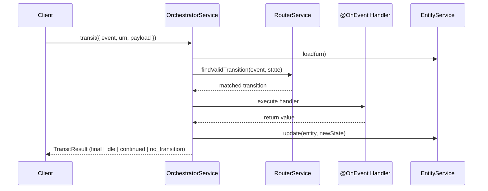

# Introduction

NestflowJS is a decorator-based state machine library for NestJS. Define workflows with `@Workflow`, handle events with `@OnEvent`, and let the orchestrator drive state transitions automatically. Zero runtime dependencies beyond what NestJS already requires.

## When to Use NestflowJS

NestflowJS is built for **backend workflows with clear states and transitions**:

- **Order processing** — pending, processing, shipped, delivered, cancelled
- **Approval workflows** — draft, pending review, approved, rejected
- **Payment flows** — initiated, authorized, captured, failed, refunded
- **Subscription management** — trial, active, suspended, cancelled
- **User onboarding** — registered, email verified, profile completed, activated

If your entities move through a defined set of states in response to events, NestflowJS gives you a declarative, testable way to manage that.

## When NOT to Use NestflowJS

Be honest about the boundaries:

- **Simple CRUD** — if entities don't have meaningful state progressions, you don't need a state machine
- **Complex parallel states** — NestflowJS handles sequential state machines; it does not support nested or parallel state charts (yet)
- **Visual workflow builders** — there is no drag-and-drop editor; workflows are defined in code
- **Non-NestJS projects** — the library depends on NestJS dependency injection and module system
- **Multi-language orchestration** — if you need workflows that span Python, Go, and TypeScript, consider Temporal

## Key Features

- **NestJS-native** — decorators, modules, dependency injection. Workflows integrate with your existing NestJS app, not fight it. ([Workflow definition](/docs/concepts/workflow-definition))
- **Declarative state machines** — define states, transitions, and conditions in a single `@Workflow` decorator. The engine enforces valid transitions at runtime. ([States & transitions](/docs/concepts/states-and-transitions))
- **Auto-continuation** — workflows automatically chain through non-idle states. Define the transitions; the orchestrator handles the loop. ([TransitResult](/docs/api-reference/adapters#transitresult))
- **Adapter pattern** — same workflow definition runs in HTTP controllers, Lambda handlers, or durable functions. Switch runtimes without rewriting business logic. ([Adapters](/docs/api-reference/adapters))
- **Built-in retry** — `@WithRetry` with exponential backoff, jitter, and configurable strategies. `UnretriableException` for permanent failures. ([Retry guide](/docs/recipes/retry-and-error-handling))
- **Schema-agnostic validation** — `@Payload(schema)` with a pluggable `PayloadValidator`. Use Zod, Joi, class-validator, or anything else. ([Decorators](/docs/api-reference/decorators))
- **Zero runtime dependencies** — only peer dependencies on `@nestjs/common`, `@nestjs/core`, `reflect-metadata`, and `rxjs`. Subpath exports (`nestflow-js/core`, `nestflow-js/adapter`) for tree-shaking.
- **Storage-agnostic** — implement the `IWorkflowEntity` interface with any database: DynamoDB, Prisma, TypeORM, in-memory. ([Interfaces](/docs/api-reference/interfaces))

## How It Works (30-Second Version)

## Roadmap

Planned features for future releases:

- **Event bus** — built-in event publishing after state transitions (`nestflow-js/event-bus`)
- **Additional adapters** — SQS-based Lambda adapter, Kafka consumer adapter
- **Workflow visualization** — Mermaid diagram generation from workflow definitions
- **Saga support** — distributed transaction patterns with compensation

## Next Steps

- [Quick Start](/docs/quick-start) — get a workflow running in 5 minutes
- [Workflow Concepts](/docs/concepts/workflow-definition) — states, transitions, and events in depth
- [Examples](/docs/examples/lambda-order-state-machine) — complete working example
