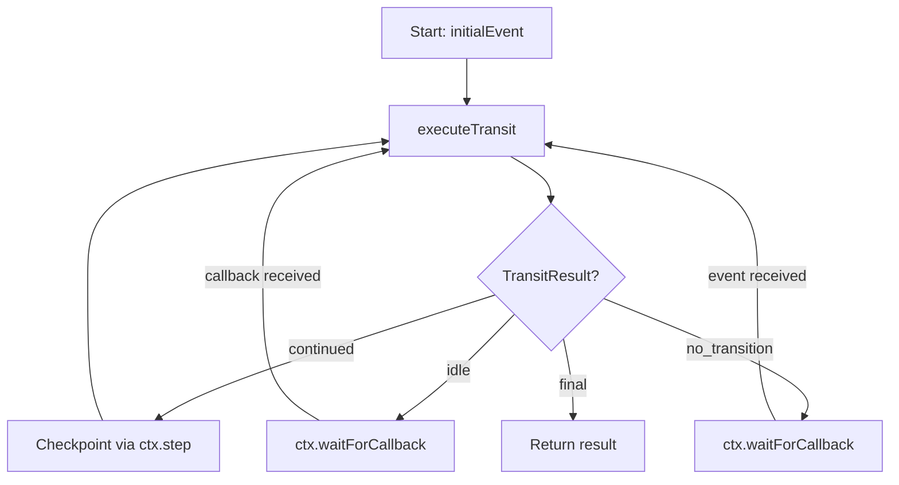

## Overview

The `DurableLambdaEventHandler` wraps your workflow in AWS Lambda's [Durable Execution SDK](https://docs.aws.amazon.com/lambda/latest/dg/durable-execution.html). Each workflow instance runs as a single durable execution spanning multiple Lambda invocations. Steps are checkpointed at event boundaries — on replay, completed steps return stored results.

## Setup

```typescript
import { NestFactory } from '@nestjs/core';
import { DurableLambdaEventHandler } from 'nestflow-js/adapter';
import { withDurableExecution } from '@aws/durable-execution-sdk-js';
import { AppModule } from './app.module';

const app = await NestFactory.createApplicationContext(AppModule);
export const handler = DurableLambdaEventHandler(app, withDurableExecution);
```

### Parameters

- `app` — NestJS application context containing the workflow module
- `withDurableExecution` — the `withDurableExecution` function from `@aws/durable-execution-sdk-js`

## How It Works

The adapter loops over `transit()` calls, reacting to each [TransitResult](/docs/api-reference/adapters#transitresult):



1. **`continued`** — Checkpoints the next event via `ctx.step()`, then calls `transit()` again
2. **`idle`** — Pauses via `ctx.waitForCallback()`. An external system resumes by calling `SendDurableExecutionCallbackSuccess`
3. **`no_transition`** — Also pauses via `ctx.waitForCallback()`, waiting for an explicit event
4. **`final`** — Returns the completed result, ending the durable execution

## Event Shape

The adapter expects a `DurableWorkflowEvent` and returns a `DurableWorkflowResult`:

```typescript
interface DurableWorkflowEvent {
  urn: string | number;      // Entity identifier
  initialEvent: string;      // First event to fire
  payload?: any;             // Optional initial payload
}

interface DurableWorkflowResult {
  urn: string | number;
  status: string;            // 'completed' (mapped from 'final')
  state: string | number;    // Final state value
}
```

## Idle State Callbacks

When the workflow reaches an idle state, the adapter calls `ctx.waitForCallback()` and pauses:

```
1. Event arrives → orchestrator sees entity is in idle state → returns { status: 'idle' }
2. Adapter calls ctx.waitForCallback('idle:pending_approval:0', ...)
3. Lambda returns, but durable execution stays open
4. External system calls SendDurableExecutionCallbackSuccess → workflow resumes
```

### Resuming via Callback

```typescript
import { LambdaClient, SendDurableExecutionCallbackSuccessCommand } from '@aws-sdk/client-lambda';

const lambda = new LambdaClient({});

await lambda.send(new SendDurableExecutionCallbackSuccessCommand({
  CallbackId: callbackId,  // logged by the adapter when it paused
  Result: JSON.stringify({
    event: 'order.approve',
    payload: { approved: true },
  }),
}));
```

### Timeout Configuration

The default callback timeout is **24 hours**. Configure per-state timeouts via `IdleStateEntry`:

```typescript
@Workflow({
  states: {
    idles: [
      OrderStatus.Pending,                                          // uses default 24h
      { state: OrderStatus.AwaitingApproval, timeout: { hours: 48 } },  // custom 48h
    ],
    // ...
  },
  defaultCallbackTimeout: { hours: 12 },  // override default for all idle states
})
```

## Retry Integration

The adapter respects `@WithRetry` configuration. On each failed attempt:

1. Catches the error (unless `UnretriableException`)
2. Calculates delay via `RetryBackoff.calculateDelay(attempt, retryConfig)`
3. Calls `ctx.wait({ seconds })` for a durable sleep between attempts
4. Retries the `transit()` call

```typescript
@OnEvent('payment.authorize')
@WithRetry({
  handler: 'handleAuthorize',
  maxAttempts: 3,
  strategy: RetryStrategy.EXPONENTIAL_JITTER,
  initialDelay: 1000,
  maxDelay: 30000,
})
async handleAuthorize(@Entity() payment: Payment) {
  // Transient failures → retried with durable waits
  // UnretriableException → immediate failure, no retry
}
```

## IDurableContext Interface

The `IDurableContext` abstracts the durable execution runtime. The real implementation comes from `@aws/durable-execution-sdk-js`; the interface is exported for mocking:

```typescript
import type { IDurableContext } from 'nestflow-js/adapter';

interface IDurableContext {
  step<T>(name: string, fn: () => Promise<T>): Promise<T>;
  waitForCallback<T>(
    name: string,
    onRegister: (callbackId: string) => Promise<void>,
    options?: { timeout?: { hours?: number; minutes?: number; seconds?: number } },
  ): Promise<T>;
  wait(duration: { seconds?: number; minutes?: number; hours?: number }): Promise<void>;
  logger: { info(msg: string, data?: any): void };
}
```

## Testing with MockDurableContext

Mock the durable context for tests without deploying to AWS:

```typescript
import { Test } from '@nestjs/testing';
import { WorkflowModule } from 'nestflow-js/core';
import { DurableLambdaEventHandler } from 'nestflow-js/adapter';
import type { IDurableContext } from 'nestflow-js/adapter';

class MockDurableContext implements IDurableContext {
  private steps = new Map<string, any>();
  private callbacks = new Map<string, { resolve: (value: any) => void }>();

  logger = { info: (_msg: string, _data?: any) => {} };

  async step<T>(name: string, fn: () => Promise<T>): Promise<T> {
    if (this.steps.has(name)) return this.steps.get(name);
    const result = await fn();
    this.steps.set(name, result);
    return result;
  }

  async waitForCallback<T>(
    name: string,
    onRegister: (callbackId: string) => Promise<void>,
  ): Promise<T> {
    const callbackId = `callback:${name}`;
    let resolve: (value: any) => void;
    const promise = new Promise<T>((r) => { resolve = r; });
    this.callbacks.set(callbackId, { resolve: resolve! });
    await onRegister(callbackId);
    return promise;
  }

  async wait(): Promise<void> {}

  submitCallback(name: string, payload: any): void {
    const entry = this.callbacks.get(`callback:${name}`);
    if (!entry) throw new Error(`No callback registered for: callback:${name}`);
    entry.resolve(payload);
  }
}

// Mock withDurableExecution — pass-through
const mockWithDurableExecution = (handler) => handler as any;

// Usage
const module = await Test.createTestingModule({
  imports: [
    WorkflowModule.register({
      entities: [{ provide: 'entity.order', useValue: new OrderEntityService() }],
      workflows: [OrderWorkflow],
    }),
  ],
}).compile();

const app = module.createNestApplication();
await app.init();

const handler = DurableLambdaEventHandler(app, mockWithDurableExecution);
const ctx = new MockDurableContext();

// Start workflow — pauses at idle state
const resultPromise = handler(
  { urn: 'order-1', initialEvent: 'order.created', payload: {} },
  ctx,
);

// Simulate callback
ctx.submitCallback('idle:pending:0', {
  event: 'order.submit',
  payload: { approved: true },
});

const result = await resultPromise;
// result.status === 'completed'
```

## Related

- [Adapters API](/docs/api-reference/adapters) — TransitResult, BaseWorkflowAdapter
- [Human in the Loop](/docs/recipes/human-in-the-loop) — idle state + callback pattern
- [Custom Adapter](/docs/recipes/custom-adapter) — build your own adapter
- [Lambda Order Example](/docs/examples/lambda-order-state-machine) — complete deployment example
